# DIAGRAMA DE CASOS DE USO DE ALTO NIVEL

## Sistema de Intermediación Laboral con Recomendaciones basadas en Machine Learning

**Versión:** 1.0
**Fecha:** Febrero 2026
**Proyecto:** Plataforma de Intermediación Laboral Universitaria

---

## 1. DESCRIPCIÓN GENERAL DEL SISTEMA

El sistema es una **plataforma web de intermediación laboral** diseñada para conectar estudiantes y titulados universitarios con oportunidades laborales (pasantías y empleos) mediante un sistema inteligente de recomendaciones basado en Machine Learning.

### Objetivos del Sistema:
- Digitalizar perfiles profesionales de estudiantes y titulados mediante extracción automática de CVs
- Gestionar ofertas laborales de instituciones públicas y privadas
- Evaluar la correspondencia entre candidatos y ofertas usando algoritmos de ML
- Generar recomendaciones personalizadas basadas en el perfil del usuario
- Proporcionar herramientas de gestión y reportes para administradores

---

## 2. DIAGRAMA 1: ACTORES DEL SISTEMA

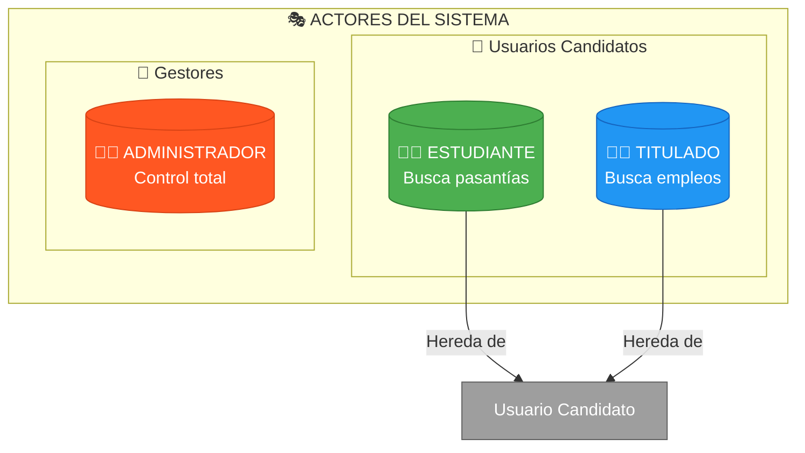

### Descripción de Actores:

| Actor | Rol | Permisos | Restricciones |
|-------|-----|----------|---------------|
| **Estudiante** | Usuario activo universitario | Perfil, CV, Recomendaciones de **pasantías** | Sin acceso a empleos |
| **Titulado** | Egresado universitario | Perfil, CV, Recomendaciones de **empleos** | Sin acceso a pasantías |
| **Administrador** | Gestor del sistema | Acceso completo a todos los módulos | Ninguna |

---

## 3. DIAGRAMA 2: ARQUITECTURA MODULAR DEL SISTEMA

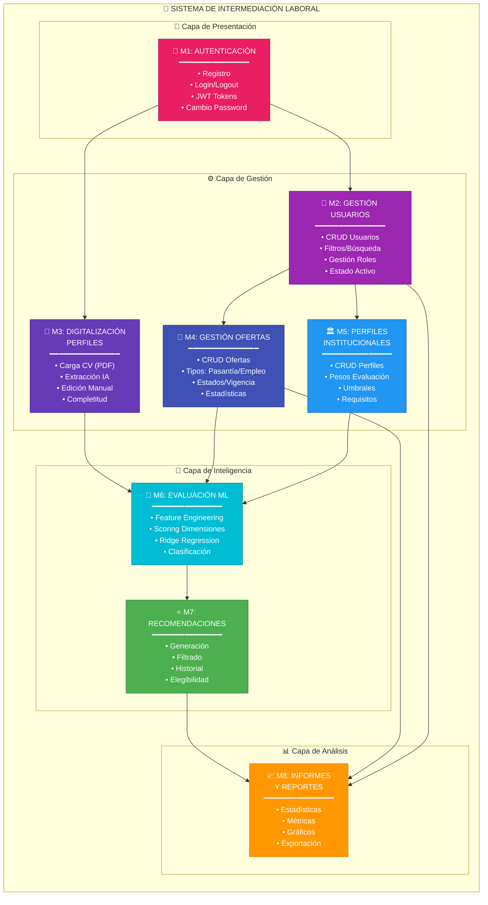

---

## 4. DIAGRAMA 3: CASOS DE USO - VISTA GENERAL

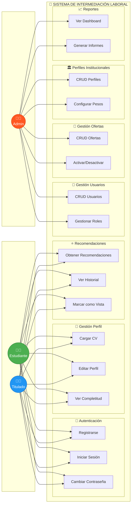

---

## 5. DIAGRAMA 4: CASOS DE USO - MÓDULO AUTENTICACIÓN (M1)

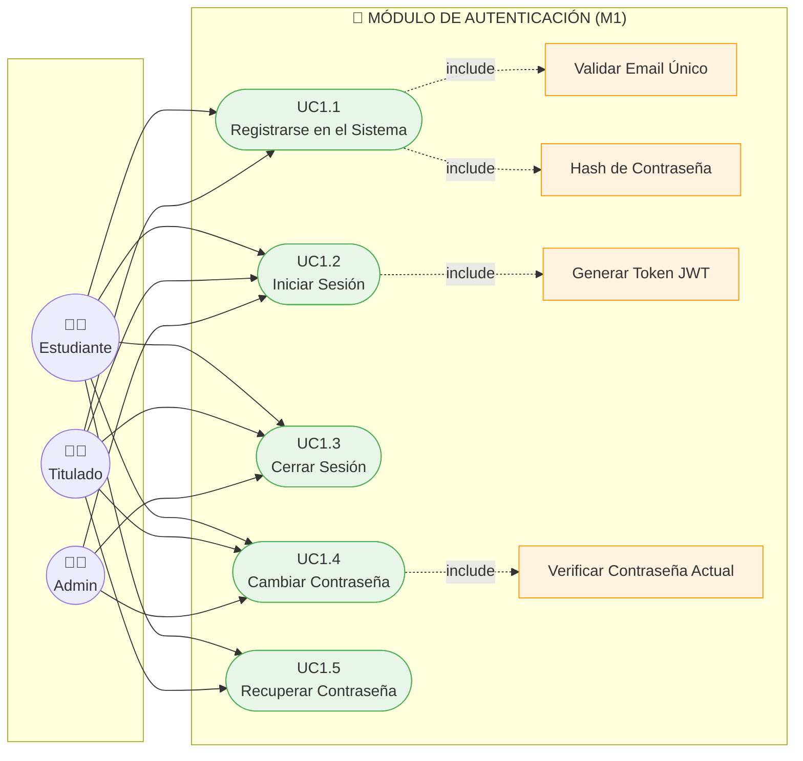

### Detalle de Casos de Uso - Autenticación

| ID | Caso de Uso | Descripción | Precondición | Postcondición |
|----|-------------|-------------|--------------|---------------|
| UC1.1 | Registrarse | Crear cuenta con email, contraseña, rol | Sin cuenta previa | Cuenta creada + perfil vacío |
| UC1.2 | Iniciar Sesión | Acceder con credenciales | Cuenta activa | Token JWT generado |
| UC1.3 | Cerrar Sesión | Finalizar sesión | Sesión activa | Token invalidado |
| UC1.4 | Cambiar Contraseña | Modificar contraseña | Sesión activa | Contraseña actualizada |
| UC1.5 | Recuperar Contraseña | Restablecer acceso | Cuenta existente | Nueva contraseña |

---

## 6. DIAGRAMA 5: CASOS DE USO - DIGITALIZACIÓN DE PERFILES (M3)

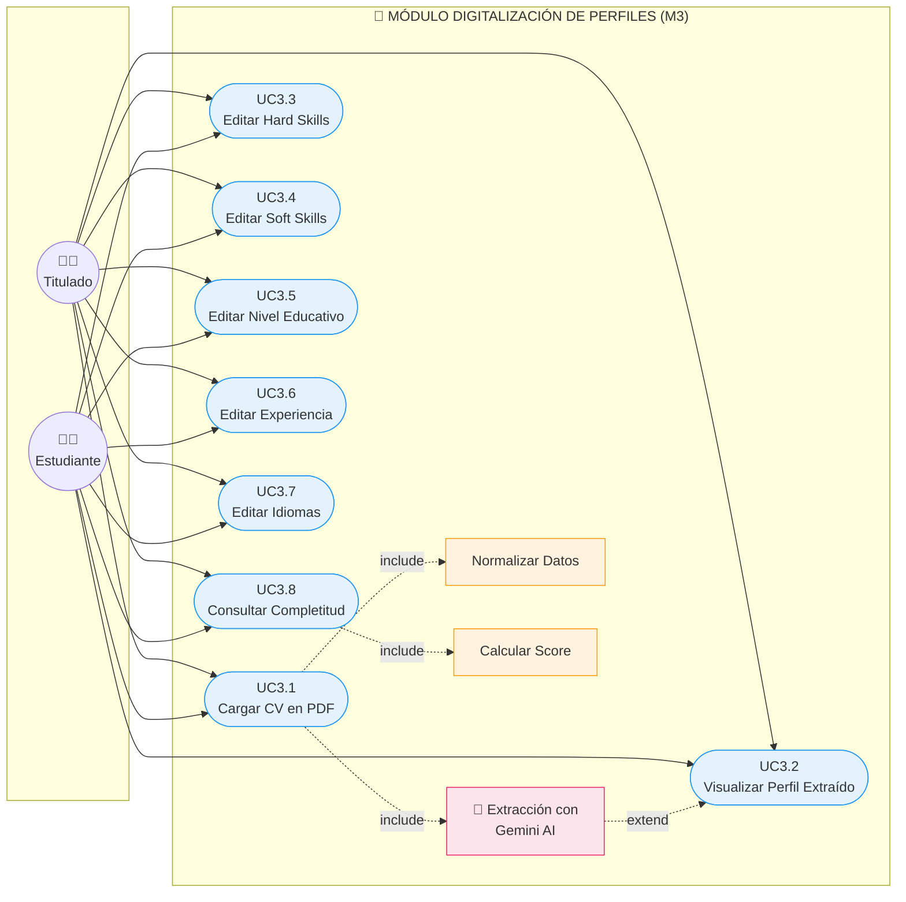

### Detalle de Casos de Uso - Digitalización

| ID | Caso de Uso | Descripción | Precondición | Postcondición |
|----|-------------|-------------|--------------|---------------|
| UC3.1 | Cargar CV | Subir PDF (máx 10MB) | Sesión activa | Datos extraídos con IA |
| UC3.2 | Visualizar Perfil | Ver datos extraídos | CV procesado | Perfil mostrado |
| UC3.3 | Editar Hard Skills | Modificar skills técnicas | Perfil existente | Skills actualizadas |
| UC3.4 | Editar Soft Skills | Modificar skills blandas | Perfil existente | Skills actualizadas |
| UC3.5 | Editar Educación | Modificar nivel educativo | Perfil existente | Educación actualizada |
| UC3.6 | Editar Experiencia | Modificar años experiencia | Perfil existente | Experiencia actualizada |
| UC3.7 | Editar Idiomas | Modificar idiomas/niveles | Perfil existente | Idiomas actualizados |
| UC3.8 | Consultar Completitud | Ver % de completitud | Perfil existente | Score mostrado |

---

## 7. DIAGRAMA 6: CASOS DE USO - ADMINISTRACIÓN

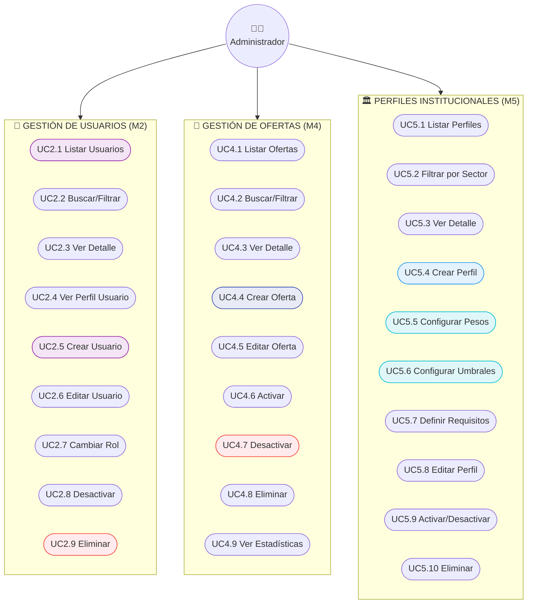

---

## 8. DIAGRAMA 7: CASOS DE USO - RECOMENDACIONES Y ML

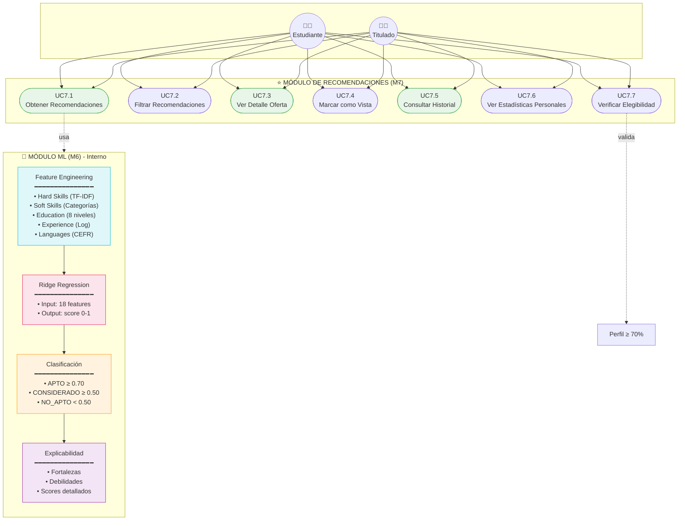

### Detalle de Casos de Uso - Recomendaciones

| ID | Caso de Uso | Descripción | Precondición | Postcondición |
|----|-------------|-------------|--------------|---------------|
| UC7.1 | Obtener Recomendaciones | Recibir ofertas ordenadas por match | Perfil ≥ 70% | Lista de recomendaciones |
| UC7.2 | Filtrar | Aplicar filtros (sector, clasificación) | Recomendaciones existentes | Resultados filtrados |
| UC7.3 | Ver Detalle | Ver oferta con scores detallados | Recomendación existente | Detalle con fortalezas/debilidades |
| UC7.4 | Marcar Vista | Actualizar estado de recomendación | Recomendación existente | fue_vista = true |
| UC7.5 | Historial | Ver todas las recomendaciones recibidas | Usuario autenticado | Historial paginado |
| UC7.6 | Estadísticas | Ver métricas personales | Usuario autenticado | Stats mostradas |
| UC7.7 | Verificar Elegibilidad | Validar requisitos para recibir recomendaciones | Usuario autenticado | Estado de elegibilidad |

---

## 9. DIAGRAMA 8: CASOS DE USO - REPORTES (M8)

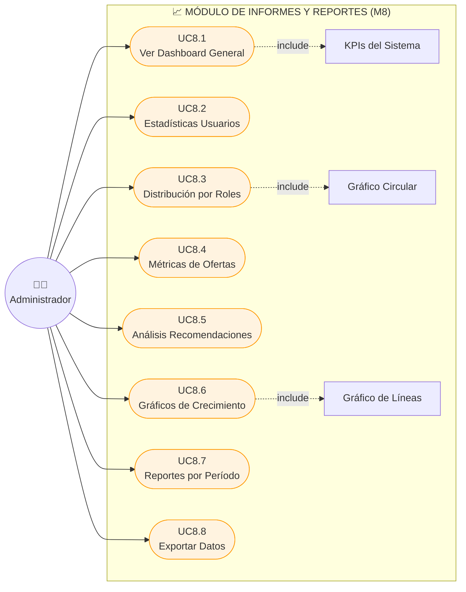

---

## 10. DIAGRAMA 9: FLUJO PRINCIPAL DEL SISTEMA

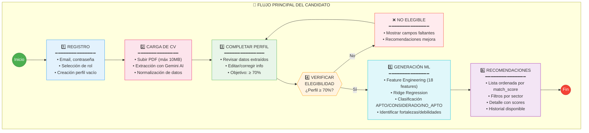

---

## 11. MATRIZ DE ACCESO ACTOR - MÓDULO

```mermaid
flowchart TB
    subgraph MATRIZ["📊 MATRIZ DE ACCESO"]
        direction TB

        subgraph HEADER[""]
            H1["MÓDULO"]
            H2["Estudiante"]
            H3["Titulado"]
            H4["Admin"]
        end

        subgraph R1["M1: Autenticación"]
            M1_E["✅"]
            M1_T["✅"]
            M1_A["✅"]
        end

        subgraph R2["M2: Gestión Usuarios"]
            M2_E["❌"]
            M2_T["❌"]
            M2_A["✅"]
        end

        subgraph R3["M3: Digitalización Perfiles"]
            M3_E["✅"]
            M3_T["✅"]
            M3_A["✅"]
        end

        subgraph R4["M4: Gestión Ofertas"]
            M4_E["❌"]
            M4_T["❌"]
            M4_A["✅"]
        end

        subgraph R5["M5: Perfiles Institucionales"]
            M5_E["❌"]
            M5_T["❌"]
            M5_A["✅"]
        end

        subgraph R6["M6: Evaluación ML"]
            M6_E["🔄 Auto"]
            M6_T["🔄 Auto"]
            M6_A["🔄 Auto"]
        end

        subgraph R7["M7: Recomendaciones"]
            M7_E["✅ Pasantías"]
            M7_T["✅ Empleos"]
            M7_A["✅ Todo"]
        end

        subgraph R8["M8: Reportes"]
            M8_E["❌"]
            M8_T["❌"]
            M8_A["✅"]
        end
    end

    style M1_E fill:#E8F5E9,stroke:#4CAF50
    style M1_T fill:#E8F5E9,stroke:#4CAF50
    style M1_A fill:#E8F5E9,stroke:#4CAF50
    style M2_E fill:#FFEBEE,stroke:#F44336
    style M2_T fill:#FFEBEE,stroke:#F44336
    style M2_A fill:#E8F5E9,stroke:#4CAF50
    style M7_E fill:#E3F2FD,stroke:#2196F3
    style M7_T fill:#E3F2FD,stroke:#2196F3
```

### Leyenda:
| Símbolo | Significado |
|---------|-------------|
| ✅ | Acceso completo |
| ❌ | Sin acceso |
| 🔄 Auto | Módulo automático/interno |
| ✅ Pasantías | Solo recomendaciones de pasantías |
| ✅ Empleos | Solo recomendaciones de empleos |

---

## 12. MODELO ENTIDAD-RELACIÓN

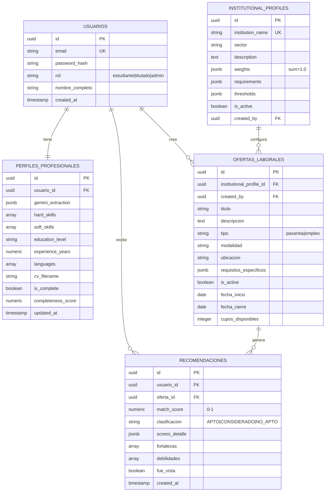

---

## 13. COMPONENTES DEL MÓDULO ML

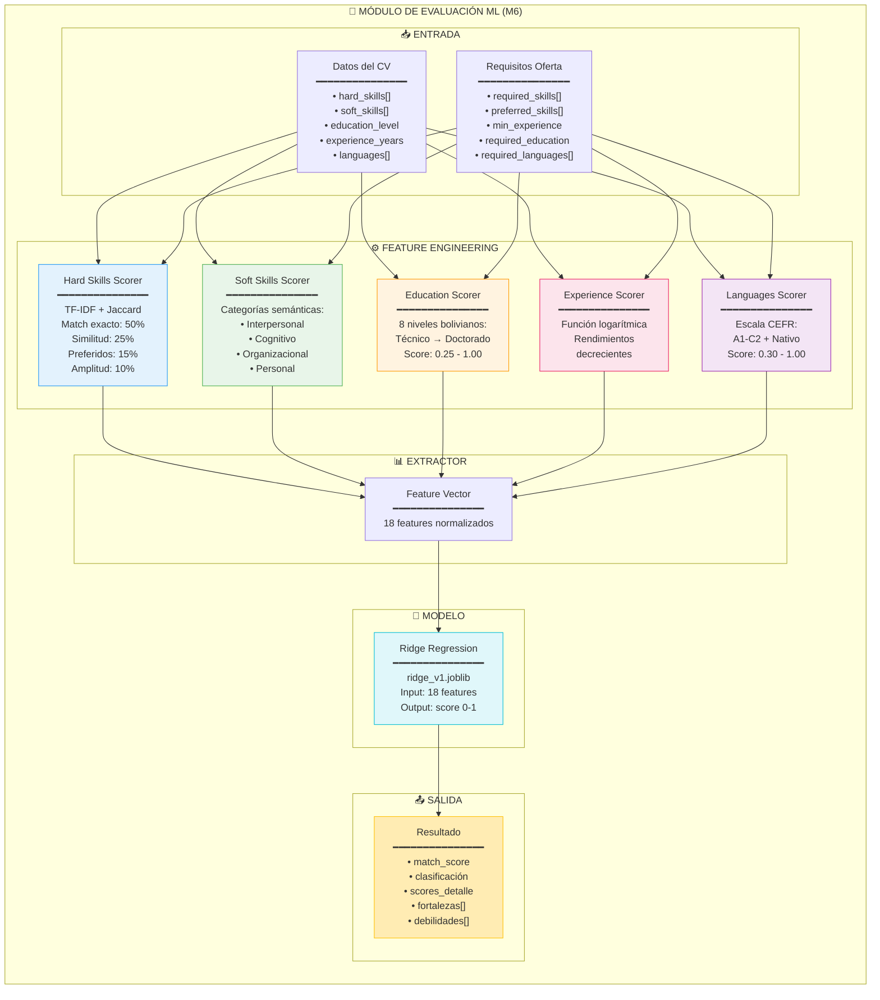

---

## 14. PERFILES INSTITUCIONALES CONFIGURADOS

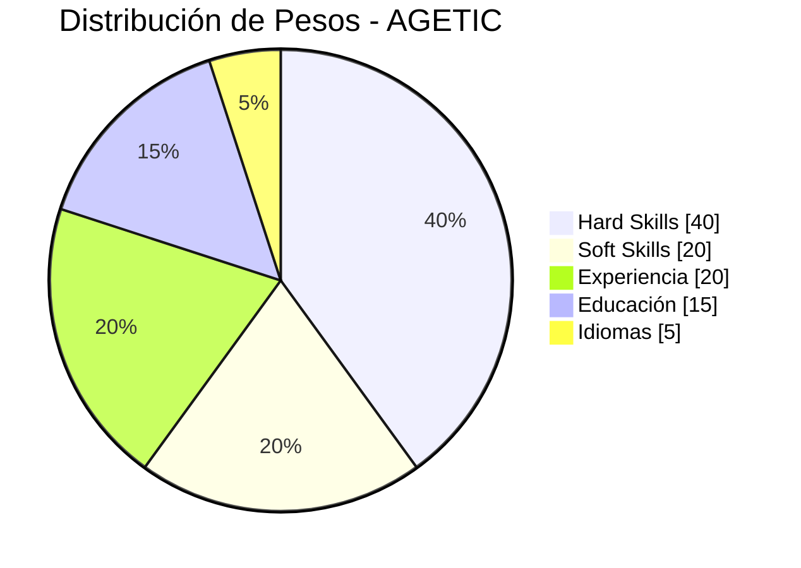

| Institución | Sector | Hard Skills | Soft Skills | Experiencia | Educación | Idiomas |
|-------------|--------|:-----------:|:-----------:|:-----------:|:---------:|:-------:|
| **AGETIC** | Gobierno - Tecnología | 40% | 20% | 20% | 15% | 5% |
| **Banco FIE** | Finanzas | 30% | 25% | 20% | 15% | 10% |
| **Droguería INTI** | Farmacéutico | 25% | 30% | 20% | 15% | 10% |
| **Empacar S.A.** | Manufactura | 35% | 20% | 30% | 10% | 5% |
| **MOPSV** | Gobierno | 30% | 20% | 25% | 15% | 10% |

---

## 15. ESCALAS DE EVALUACIÓN

### 15.1 Niveles Educativos (Sistema Boliviano)

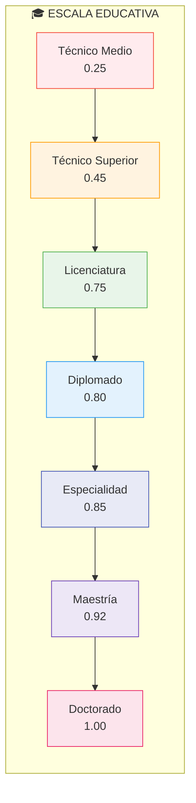

### 15.2 Niveles de Idiomas (CEFR)

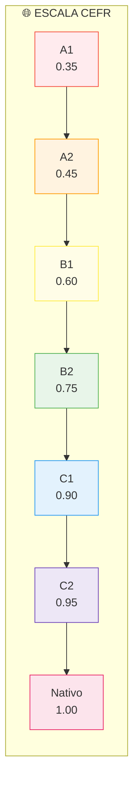

---

## 16. STACK TECNOLÓGICO

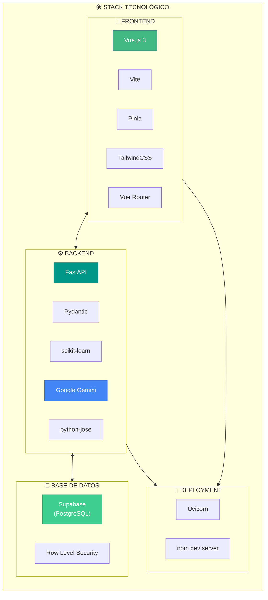

---

## 17. RESUMEN DE CASOS DE USO POR ACTOR

### Estudiante (12 casos de uso)
| Módulo | Casos de Uso |
|--------|--------------|
| M1 - Autenticación | UC1.1, UC1.2, UC1.3, UC1.4, UC1.5 |
| M3 - Digitalización | UC3.1, UC3.2, UC3.3, UC3.4, UC3.5, UC3.6, UC3.7, UC3.8 |
| M7 - Recomendaciones | UC7.1*, UC7.2, UC7.3, UC7.4, UC7.5, UC7.6, UC7.7 |

*Solo pasantías

### Titulado (12 casos de uso)
| Módulo | Casos de Uso |
|--------|--------------|
| M1 - Autenticación | UC1.1, UC1.2, UC1.3, UC1.4, UC1.5 |
| M3 - Digitalización | UC3.1, UC3.2, UC3.3, UC3.4, UC3.5, UC3.6, UC3.7, UC3.8 |
| M7 - Recomendaciones | UC7.1**, UC7.2, UC7.3, UC7.4, UC7.5, UC7.6, UC7.7 |

**Solo empleos

### Administrador (30+ casos de uso)
| Módulo | Casos de Uso |
|--------|--------------|
| M1 - Autenticación | UC1.2, UC1.3, UC1.4 |
| M2 - Gestión Usuarios | UC2.1 - UC2.9 |
| M3 - Digitalización | UC3.1 - UC3.8 |
| M4 - Gestión Ofertas | UC4.1 - UC4.9 |
| M5 - Perfiles Inst. | UC5.1 - UC5.11 |
| M7 - Recomendaciones | UC7.1 - UC7.7 (todos) |
| M8 - Reportes | UC8.1 - UC8.8 |

---

## 18. CONCLUSIONES

Este documento presenta el diagrama de casos de uso de alto nivel para el **Sistema de Intermediación Laboral con Recomendaciones basadas en Machine Learning**.

### Módulos Identificados (8):
1. **M1:** Autenticación
2. **M2:** Gestión de Usuarios
3. **M3:** Digitalización de Perfiles
4. **M4:** Gestión de Ofertas Laborales
5. **M5:** Perfiles Institucionales
6. **M6:** Evaluación de Correspondencia (ML)
7. **M7:** Sistema de Recomendaciones
8. **M8:** Informes y Reportes

### Roles del Sistema (3):
- **Estudiante:** Acceso a pasantías
- **Titulado:** Acceso a empleos
- **Administrador:** Control total del sistema

### Total de Casos de Uso: **50+**

---

**Documento generado para el Trabajo de Grado**
**Plataforma de Intermediación Laboral Universitaria**
**Febrero 2026**
