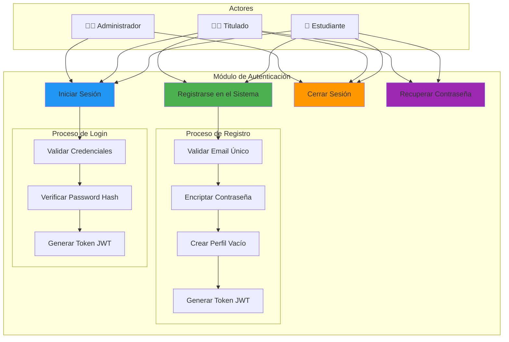
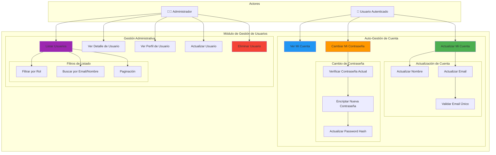
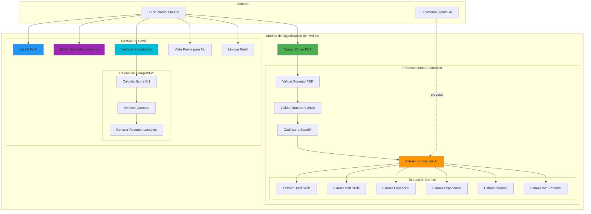
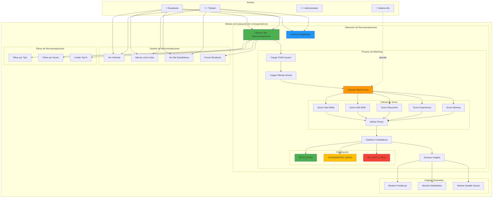

```mermaid
graph TB
    subgraph Actores
        ADM[👨‍💼 Administrador]
        SYS[🤖 Sistema ML]
    end

    subgraph "Módulo de Gestión de Perfiles Institucionales"
        subgraph "CRUD de Perfiles"
            LIST_INST[Listar Perfiles Institucionales]
            GET_INST[Obtener Perfil por ID]
            CREATE_INST[Crear Perfil Institucional]
            UPDATE_INST[Actualizar Perfil]
            DELETE_INST[Desactivar Perfil]
            ACTIVATE_INST[Reactivar Perfil]
            
            subgraph "Filtros de Listado"
                FILT_ACTIVE[Filtrar por Estado]
                FILT_SECTOR[Filtrar por Sector]
            end
        end
        
        subgraph "Configuración de Perfil"
            SET_WEIGHTS[Configurar Pesos]
            SET_REQ[Configurar Requisitos]
            SET_THRESH[Configurar Umbrales]
            
            subgraph "Pesos de Evaluación"
                W_HARD[Peso Hard Skills]
                W_SOFT[Peso Soft Skills]
                W_EDU[Peso Educación]
                W_EXP[Peso Experiencia]
                W_LANG[Peso Idiomas]
            end
            
            subgraph "Umbrales"
                T_APTO[Umbral Apto ≥70%]
                T_CONSID[Umbral Considerado ≥50%]
            end
        end
        
        subgraph "Gestión de Sectores"
            LIST_SECT[Listar Sectores]
        end
        
        CACHE_INV[Invalidar Cache ML]
    end

    %% Conexiones Administrador
    ADM --> LIST_INST
    ADM --> GET_INST
    ADM --> CREATE_INST
    ADM --> UPDATE_INST
    ADM --> DELETE_INST
    ADM --> ACTIVATE_INST
    ADM --> LIST_SECT

    %% Filtros
    LIST_INST --> FILT_ACTIVE
    LIST_INST --> FILT_SECTOR

    %% Configuración
    CREATE_INST --> SET_WEIGHTS
    CREATE_INST --> SET_REQ
    CREATE_INST --> SET_THRESH
    UPDATE_INST --> SET_WEIGHTS
    UPDATE_INST --> SET_REQ
    UPDATE_INST --> SET_THRESH

    %% Pesos
    SET_WEIGHTS --> W_HARD
    SET_WEIGHTS --> W_SOFT
    SET_WEIGHTS --> W_EDU
    SET_WEIGHTS --> W_EXP
    SET_WEIGHTS --> W_LANG

    %% Umbrales
    SET_THRESH --> T_APTO
    SET_THRESH --> T_CONSID

    %% Cache
    CREATE_INST -.->|invalida| CACHE_INV
    UPDATE_INST -.->|invalida| CACHE_INV
    DELETE_INST -.->|invalida| CACHE_INV
    ACTIVATE_INST -.->|invalida| CACHE_INV

    %% Sistema
    SYS -.->|usa| CACHE_INV

    style CREATE_INST fill:#4CAF50
    style UPDATE_INST fill:#2196F3
    style DELETE_INST fill:#F44336
    style SET_WEIGHTS fill:#FF9800
    style CACHE_INV fill:#9C27B0
```

```mermaid
graph TB
    subgraph Actores
        ADM[👨‍💼 Administrador]
        EST[👤 Estudiante]
        TIT[👨‍🎓 Titulado]
    end

    subgraph "Módulo de Gestión de Ofertas"
        subgraph "Gestión Administrativa"
            LIST_OFF[Listar Ofertas]
            GET_OFF[Obtener Oferta por ID]
            CREATE_OFF[Crear Oferta]
            UPDATE_OFF[Actualizar Oferta]
            DELETE_OFF[Desactivar Oferta]
            ACTIVATE_OFF[Reactivar Oferta]
            STATS_OFF[Ver Estadísticas]
            
            subgraph "Filtros de Listado"
                FILT_TIPO[Filtrar por Tipo]
                FILT_ACTIVE[Filtrar por Estado]
                FILT_SECTOR[Filtrar por Sector]
                FILT_EXP[Incluir Expiradas]
                PAGINATE[Paginación]
            end
        end
        
        subgraph "Configuración de Oferta"
            SET_BASIC[Datos Básicos]
            SET_REQ[Requisitos Específicos]
            SET_DATES[Fechas de Vigencia]
            SET_CUPOS[Cupos Disponibles]
            
            subgraph "Tipos de Oferta"
                TIPO_PAS[Pasantía]
                TIPO_EMP[Empleo]
            end
            
            subgraph "Modalidades"
                MOD_PRES[Presencial]
                MOD_REM[Remoto]
                MOD_HIB[Híbrido]
            end
        end
        
        subgraph "Visualización Pública"
            VIEW_OFFERS[Ver Ofertas Disponibles]
            SEARCH_OFFERS[Buscar Ofertas]
        end
    end

    %% Administrador
    ADM --> LIST_OFF
    ADM --> GET_OFF
    ADM --> CREATE_OFF
    ADM --> UPDATE_OFF
    ADM --> DELETE_OFF
    ADM --> ACTIVATE_OFF
    ADM --> STATS_OFF

    %% Filtros Admin
    LIST_OFF --> FILT_TIPO
    LIST_OFF --> FILT_ACTIVE
    LIST_OFF --> FILT_SECTOR
    LIST_OFF --> FILT_EXP
    LIST_OFF --> PAGINATE

    %% Configuración
    CREATE_OFF --> SET_BASIC
    CREATE_OFF --> SET_REQ
    CREATE_OFF --> SET_DATES
    CREATE_OFF --> SET_CUPOS
    UPDATE_OFF --> SET_BASIC
    UPDATE_OFF --> SET_REQ
    UPDATE_OFF --> SET_DATES
    UPDATE_OFF --> SET_CUPOS

    %% Tipos
    SET_BASIC --> TIPO_PAS
    SET_BASIC --> TIPO_EMP

    %% Modalidades
    SET_BASIC --> MOD_PRES
    SET_BASIC --> MOD_REM
    SET_BASIC --> MOD_HIB

    %% Usuarios
    EST --> VIEW_OFFERS
    EST --> SEARCH_OFFERS
    TIT --> VIEW_OFFERS
    TIT --> SEARCH_OFFERS

    style CREATE_OFF fill:#4CAF50
    style UPDATE_OFF fill:#2196F3
    style DELETE_OFF fill:#F44336
    style VIEW_OFFERS fill:#9C27B0
    style STATS_OFF fill:#FF9800
```

```mermaid
graph TB
    subgraph Actores
        ADM[👨‍💼 Administrador]
        INST[🏢 Institución]
    end

    subgraph "Módulo de Informes y Reportes"
        subgraph "Reportes de Ofertas"
            STATS_OFERTAS[Estadísticas de Ofertas]
            
            subgraph "Métricas de Ofertas"
                COUNT_TOTAL[Total de Ofertas]
                COUNT_ACTIVE[Ofertas Activas]
                COUNT_TYPE[Por Tipo]
                COUNT_SECTOR[Por Sector]
            end
        end
        
        subgraph "Reportes de Usuarios"
            LIST_USERS_REP[Listado de Usuarios]
            
            subgraph "Métricas de Usuarios"
                COUNT_USERS[Total Usuarios]
                COUNT_ROLE[Por Rol]
                PROF_COMP[Completitud Perfiles]
                CV_UPLOAD[CVs Subidos]
            end
        end
        
        subgraph "Reportes de Recomendaciones"
            STATS_RECS[Estadísticas de Matching]
            
            subgraph "Métricas de Matching"
                AVG_SCORE[Score Promedio]
                DIST_CLASS[Distribución Clasificación]
                COUNT_NEW[Nuevas vs Vistas]
                MATCH_RATE[Tasa de Coincidencia]
            end
        end
        
        subgraph "Reportes Institucionales"
            STATS_INST[Estadísticas Institucionales]
            
            subgraph "Métricas Institucionales"
                COUNT_PROF[Total Perfiles]
                COUNT_SECT[Sectores Activos]
                ACTIVE_RATE[Tasa de Actividad]
            end
        end
        
        subgraph "Exportación de Datos"
            EXPORT_JSON[Exportar JSON]
            EXPORT_CSV[Exportar CSV]
            EXPORT_EXCEL[Exportar Excel]
        end
        
        subgraph "Análisis Avanzado"
            TREND_ANALYSIS[Análisis de Tendencias]
            PERF_METRICS[Métricas de Rendimiento]
            USER_ACTIVITY[Actividad de Usuarios]
        end
    end

    %% Administrador - Acceso Total
    ADM --> STATS_OFERTAS
    ADM --> LIST_USERS_REP
    ADM --> STATS_RECS
    ADM --> STATS_INST
    ADM --> EXPORT_JSON
    ADM --> EXPORT_CSV
    ADM --> EXPORT_EXCEL
    ADM --> TREND_ANALYSIS
    ADM --> PERF_METRICS
    ADM --> USER_ACTIVITY

    %% Institución - Acceso Limitado
    INST --> STATS_OFERTAS
    INST --> STATS_RECS

    %% Métricas Ofertas
    STATS_OFERTAS --> COUNT_TOTAL
    STATS_OFERTAS --> COUNT_ACTIVE
    STATS_OFERTAS --> COUNT_TYPE
    STATS_OFERTAS --> COUNT_SECTOR

    %% Métricas Usuarios
    LIST_USERS_REP --> COUNT_USERS
    LIST_USERS_REP --> COUNT_ROLE
    LIST_USERS_REP --> PROF_COMP
    LIST_USERS_REP --> CV_UPLOAD

    %% Métricas Matching
    STATS_RECS --> AVG_SCORE
    STATS_RECS --> DIST_CLASS
    STATS_RECS --> COUNT_NEW
    STATS_RECS --> MATCH_RATE

    %% Métricas Institucionales
    STATS_INST --> COUNT_PROF
    STATS_INST --> COUNT_SECT
    STATS_INST --> ACTIVE_RATE

    style STATS_OFERTAS fill:#4CAF50
    style STATS_RECS fill:#2196F3
    style STATS_INST fill:#FF9800
    style EXPORT_JSON fill:#9C27B0
    style TREND_ANALYSIS fill:#00BCD4
```

# Diagramas de Caso de Uso Detallados por Módulo

Este documento contiene los diagramas de caso de uso detallados para cada módulo del sistema, basados en la implementación real del proyecto.

---

## 1. Módulo de Autenticación

### Diagrama de Caso de Uso



### Endpoints Implementados
- `POST /api/auth/register` - Registro de usuario
- `POST /api/auth/login` - Inicio de sesión
- Roles soportados: `estudiante`, `titulado`, `administrador`

---

## 2. Módulo de Gestión de Usuarios

### Diagrama de Caso de Uso



### Endpoints Implementados
**Auto-gestión:**
- `GET /api/users/me/account` - Ver mi cuenta
- `PUT /api/users/me` - Actualizar mi cuenta
- `PUT /api/users/me/password` - Cambiar contraseña

**Administración:**
- `GET /api/users/` - Listar usuarios (paginado)
- `GET /api/users/{user_id}` - Detalle de usuario
- `GET /api/users/{user_id}/profile` - Perfil completo
- `PUT /api/users/{user_id}` - Actualizar usuario
- `DELETE /api/users/{user_id}` - Eliminar usuario

---

## 3. Módulo de Digitalización de Perfiles

### Diagrama de Caso de Uso



### Endpoints Implementados
- `POST /api/profile/upload-cv` - Subir CV y procesar
- `GET /api/profile/me` - Ver mi perfil
- `PUT /api/profile/me` - Actualizar perfil manualmente
- `GET /api/profile/completeness` - Verificar completitud
- `GET /api/profile/preview` - Vista previa para recomendaciones
- `DELETE /api/profile/me` - Limpiar perfil

### Campos Extraídos
- **Hard Skills**: Habilidades técnicas
- **Soft Skills**: Habilidades blandas
- **Education**: Formación académica estructurada
- **Experience**: Experiencia laboral con años
- **Languages**: Idiomas con niveles
- **Personal Info**: Resumen profesional

---

## 4. Módulo de Gestión de Perfiles Institucionales

### Diagrama de Caso de Uso



### Endpoints Implementados
- `GET /api/admin/institutional-profiles` - Listar perfiles
- `GET /api/admin/institutional-profiles/{id}` - Obtener perfil
- `POST /api/admin/institutional-profiles` - Crear perfil
- `PUT /api/admin/institutional-profiles/{id}` - Actualizar perfil
- `DELETE /api/admin/institutional-profiles/{id}` - Desactivar (soft delete)
- `POST /api/admin/institutional-profiles/{id}/activate` - Reactivar
- `GET /api/admin/sectors` - Listar sectores

### Configuración de Perfiles
**Weights (Pesos):**
- `hard_skills_weight`: Peso de habilidades técnicas
- `soft_skills_weight`: Peso de habilidades blandas
- `education_weight`: Peso de educación
- `experience_weight`: Peso de experiencia
- `languages_weight`: Peso de idiomas

**Thresholds (Umbrales):**
- `apto`: 0.70 (70% - Candidato apto)
- `considerado`: 0.50 (50% - Candidato considerado)

---

## 5. Módulo de Gestión de Ofertas Institucionales

### Diagrama de Caso de Uso



### Endpoints Implementados
**Administración:**
- `GET /api/admin/ofertas` - Listar ofertas con filtros
- `GET /api/admin/ofertas/{id}` - Obtener oferta
- `POST /api/admin/ofertas` - Crear oferta
- `PUT /api/admin/ofertas/{id}` - Actualizar oferta
- `DELETE /api/admin/ofertas/{id}` - Desactivar (soft delete)
- `POST /api/admin/ofertas/{id}/activate` - Reactivar
- `GET /api/admin/ofertas/stats/summary` - Estadísticas

### Campos de Oferta
- **Básicos**: título, descripción, tipo, modalidad, ubicación
- **Institucional**: `institutional_profile_id`, sector
- **Vigencia**: `fecha_inicio`, `fecha_cierre`
- **Capacidad**: `cupos_disponibles`
- **Requisitos**: `requisitos_especificos` (JSON)

---

## 6. Módulo de Evaluación de Correspondencia

### Diagrama de Caso de Uso



### Endpoints Implementados
- `GET /api/recommendations` - Obtener recomendaciones personalizadas
- `GET /api/recommendations/check-eligibility` - Verificar elegibilidad
- `GET /api/recommendations/history` - Ver historial
- `POST /api/recommendations/{id}/viewed` - Marcar como vista
- `GET /api/recommendations/stats` - Estadísticas personales

### Algoritmo de Matching
**Dimensiones evaluadas:**
1. **Hard Skills**: Coincidencia de habilidades técnicas
2. **Soft Skills**: Coincidencia de habilidades blandas
3. **Education**: Nivel educativo vs requisitos
4. **Experience**: Años de experiencia vs requisitos
5. **Languages**: Idiomas requeridos vs disponibles

**Clasificación:**
- **APTO**: Match score ≥ 70%
- **CONSIDERADO**: Match score ≥ 50%
- **NO_APTO**: Match score < 50%

**Insights:**
- **Fortalezas**: Áreas donde el candidato destaca
- **Debilidades**: Áreas de mejora
- **Detalle de Scores**: Puntuación por dimensión

---

## 7. Módulo de Informes y Reportes

### Diagrama de Caso de Uso



### Endpoints Implementados
**Estadísticas:**
- `GET /api/admin/ofertas/stats/summary` - Estadísticas de ofertas
- `GET /api/recommendations/stats` - Estadísticas personales de matching
- `GET /api/users/` - Listado con métricas de completitud

### Métricas Disponibles
**Ofertas:**
- Total de ofertas (activas/inactivas)
- Distribución por tipo (pasantía/empleo)
- Distribución por sector
- Ofertas expiradas

**Usuarios:**
- Total de usuarios por rol
- Perfiles completos vs incompletos
- Score promedio de completitud
- CVs subidos

**Matching:**
- Score promedio de recomendaciones
- Distribución de clasificaciones (APTO/CONSIDERADO/NO_APTO)
- Recomendaciones nuevas vs vistas
- Tasa de coincidencia

---

## Diagrama de Flujo General del Sistema

```mermaid
sequenceDiagram
    participant U as Usuario
    participant AUTH as Módulo Auth
    participant PROF as Módulo Perfiles
    participant GEMINI as Gemini AI
    participant INST as Módulo Institucional
    participant OFF as Módulo Ofertas
    participant MATCH as Módulo Matching
    participant REP as Módulo Reportes

    Note over U,REP: Fase 1: Registro y Autenticación
    U->>AUTH: Registrarse (estudiante/titulado)
    AUTH->>AUTH: Validar y crear usuario
    AUTH->>PROF: Crear perfil vacío
    AUTH-->>U: Token JWT

    Note over U,REP: Fase 2: Digitalización de Perfil
    U->>PROF: Subir CV (PDF)
    PROF->>PROF: Validar archivo
    PROF->>GEMINI: Extraer datos del CV
    GEMINI-->>PROF: Datos estructurados
    PROF->>PROF: Calcular completitud
    PROF-->>U: Perfil actualizado

    Note over U,REP: Fase 3: Configuración Institucional (Admin)
    U->>INST: Crear perfil institucional
    INST->>INST: Configurar pesos y umbrales
    INST-->>U: Perfil creado

    U->>OFF: Crear oferta laboral
    OFF->>OFF: Vincular a perfil institucional
    OFF-->>U: Oferta publicada

    Note over U,REP: Fase 4: Matching y Recomendaciones
    U->>MATCH: Solicitar recomendaciones
    MATCH->>PROF: Cargar perfil usuario
    MATCH->>OFF: Cargar ofertas activas
    MATCH->>INST: Cargar configuración institucional
    MATCH->>MATCH: Calcular scores por dimensión
    MATCH->>MATCH: Aplicar pesos y clasificar
    MATCH->>MATCH: Generar insights
    MATCH-->>U: Recomendaciones ordenadas

    Note over U,REP: Fase 5: Análisis y Reportes
    U->>REP: Solicitar estadísticas
    REP->>OFF: Obtener métricas ofertas
    REP->>PROF: Obtener métricas perfiles
    REP->>MATCH: Obtener métricas matching
    REP-->>U: Dashboard de métricas
```

---

## Resumen de Tecnologías Utilizadas

### Backend
- **Framework**: FastAPI
- **Autenticación**: JWT (JSON Web Tokens)
- **Seguridad**: bcrypt para hashing de contraseñas
- **Base de Datos**: Supabase (PostgreSQL)
- **IA**: Google Gemini AI para extracción de CV
- **ML**: Sistema de scoring personalizado

### Tablas Principales
- `usuarios` - Datos de autenticación
- `perfiles_profesionales` - Perfiles digitalizados
- `institutional_profiles` - Configuración institucional
- `ofertas_laborales` - Ofertas publicadas
- `recomendaciones` - Historial de matching

### Roles del Sistema
1. **Estudiante**: Acceso a pasantías
2. **Titulado**: Acceso a empleos
3. **Administrador**: Gestión completa del sistema
